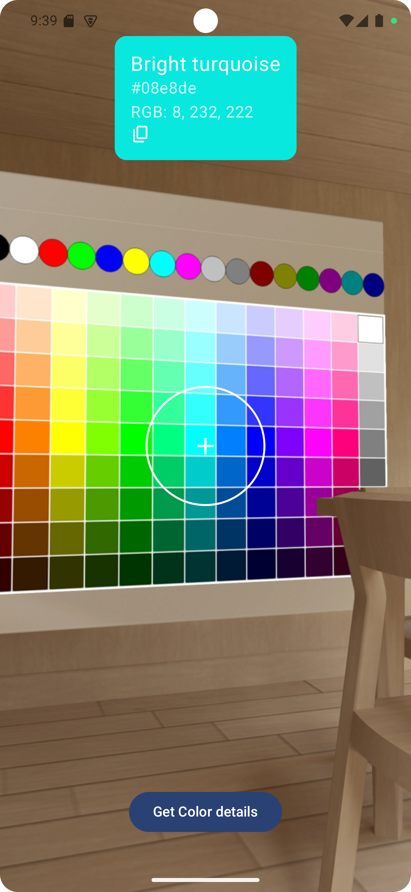
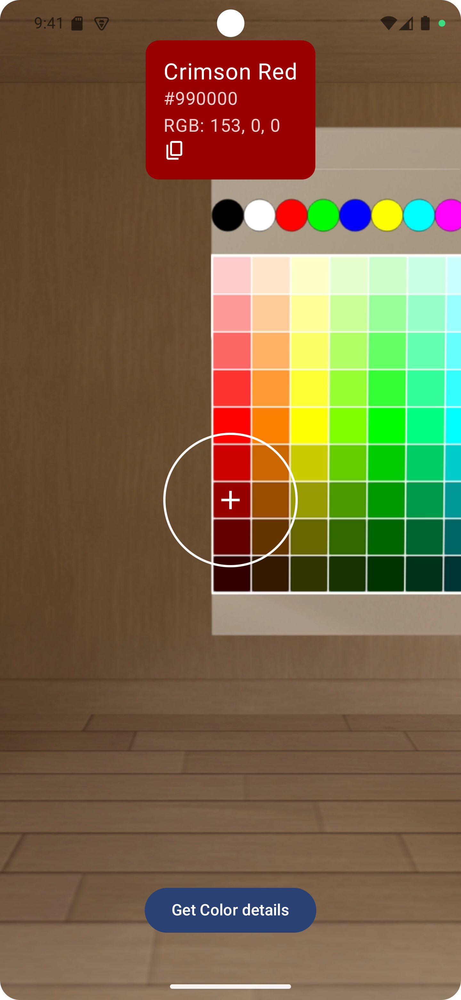
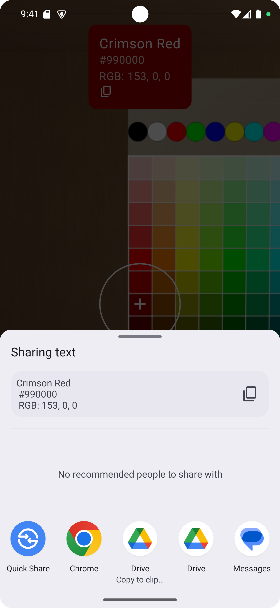

Color Lens is a simple and minimal app built with Jetpack Compose that lets you use your phone’s camera to detect and extract colors from the real world.
Just point the camera at any object to instantly see its color code (Hex / RGB).

Features

- Real-time color detection through the camera
- Display of both the color and its Hex / RGB code
- Option to copy the detected color for later use

  

  
  
  

